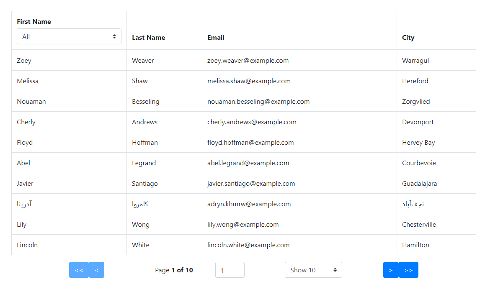

# User Directory




## URL Link

https://tableofusers.herokuapp.com/

## Description

This application is a table created through React Table v7. It pulls from an API that generates random users

## Steps

* The user is presented with a table of randomized users, with email and city they reside in
* Several pages of the users can be cycled through from numbers on the bottom
* By clicking any of the top bars of the table, one can sort the table by that parameter, ascending or descending
* Using the drop down in the top left, the user can filter the whole table by people's first names
* The very bottom row can allow the user to quick jump to certain pages and decide how many names are shown at one time


## Local Setup

**Step 1 - Clone my repo using the command line below.**
```
git clone https://github.com/Koolachoo/HW-User-Directory.git
```
**Step 2 - Install all required NPM packages.**
```
npm install
```
**Step 3 - Set up mySQL database.**
```
Make sure the files are sectioned like 

- public
- src
- package.json
- server.js

```
**Step 5 - Start the application server using the command line below**
```
npm start
```

## Technologies Used

* Node JS
* Javascript
* Heroku
* Bootstrap
* NPM Packages:
    - express
    - react
    - node

## Role in development

Sole developer of application.

